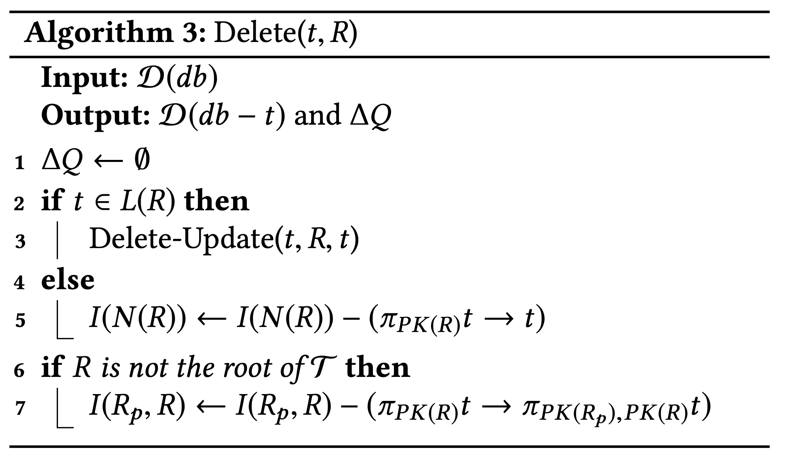
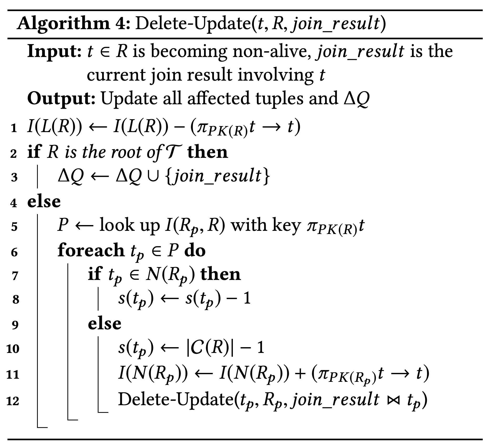

# MSBD 5014 IP Project Repository

<!-- ALL-CONTRIBUTORS-BADGE:START - Do not remove or modify this section -->

[](#contributors-)

<!-- ALL-CONTRIBUTORS-BADGE:END -->

This repository contains the source code for the [MSBD 5014 IP project](https://github.com/MichaelYang-lyx/Flink-In-One/tree/main/tpc_query), as well as various materials I have collected during this semester when learning Flink.

## Table of Contents

-   [Data Generation](#data-generation)
-   [Environment Setup](#environment-setup)
-   [Project Structure](#project-structure)
-   [Usage](#usage)
-   [Algorithm](#algorithm)
-   [References](#references)

## Data Generation

The dataset is generated using the DBGEN tool, and you can find [that](https://github.com/MichaelYang-lyx/Flink-In-One/tree/main/DBGEN) in my root directory. You can refer to the detailed documentation [here](https://docs.deistercloud.com/content/Databases.30/TPCH%20Benchmark.90/Data%20generation%20tool.30.xml?embedded=true).

You can also find a useful guide on GitHub: [TPCH DBGEN Guide](https://gist.github.com/yunpengn/6220ffc1b69cee5c861d93754e759d08).

### Important Parameters:

-   `-s <scale>`: Scale of the database population. Scale 1.0 represents ~1 GB of data.
-   `-T <table>`: Generate data for a particular table ONLY. Arguments:
    -   `p` -- part/partsupp
    -   `c` -- customer
    -   `s` -- supplier
    -   `o` -- orders/lineitem
    -   `n` -- nation
    -   `r` -- region
    -   `l` -- code (same as n and r)
    -   `O` -- orders
    -   `L` -- lineitem
    -   `P` -- part
    -   `S` -- partsupp

### Note for macOS Users:

If you encounter errors such as:

```c
bm_utils.c:71:10: fatal error: 'malloc.h' file not found
varsub.c:44:10: fatal error: 'malloc.h' file not found
```

**Solution**: Open `bm_utils.c` and `varsub.c`, locate and change the import statement `#include <malloc.h>` to `#include <sys/malloc.h>`.

## Environment Setup

To run this project, you need to have Maven and MySQL installed on your system.

## Project Structure

-   `tpc_query`: Contains the source code for the TPC-H queries.
-   `learning`: Contains various materials and resources collected during the semester.

## Usage

### Running the Project

1. Navigate to the `tpc_query` directory.
2. Configure the environment using `pom.xml`.
3. Run `Main.java` to simulate TPC-H Query 7.

### Query Execution

You can choose between querying directly in MySQL or testing the AJU algorithm implemented using Flink.

```java
String choice = "Memory";
if (choice.equals("MySQL")) {
    MySQLSink mySQLSink = new MySQLSink();
    dataSource.addSink(mySQLSink);
} else {
    MemorySink memorySink = new MemorySink();
    dataSource.addSink(memorySink);
}
```

Currently, Q7 and Q5 are supported. To try other queries, you can add them in the `/tpc_query/src/main/java/tpc_query/Query` directory following the existing format.

## Algorithm

This section provides an overview of the four main algorithms implemented in this project. Each algorithm has an associated image to illustrate the process.

### Insert Algorithm

This algorithm handles the insertion of new tuples into the database while maintaining the acyclic foreign-key join structure.


### Insert-Update Algorithm

This algorithm deals with the insertion and updating of tuples simultaneously. It ensures that the database remains consistent and acyclic.


### Delete Algorithm

This algorithm manages the deletion of tuples from the database, ensuring that the foreign-key constraints and the acyclic nature of the joins are preserved.



### Delete-Update Algorithm

This algorithm handles the deletion and updating of tuples in tandem, maintaining the integrity and acyclic structure of the foreign-key joins.



## References

1. [Maintaining Acyclic Foreign-Key Joins under Updates](https://wqc0712.github.io/): Qichen Wang and Ke Yi. ACM SIGMOD International Conference on Management of Data (SIGMOD), June 2020.
2. [Environmental Influences on Infanticide in Columbian Ground Squirrels](https://link.springer.com/article/10.1007/s00265-007-0443-y): An exploration of the factors affecting infanticide among ground squirrels.
3. [Flink](https://flink.apache.org/): Apache Flink is an open-source stream processing framework for distributed, high-performing, always-available, and accurate data streaming applications.

Feel free to explore the repository and use the provided resources. If you have any questions or need further assistance, please contact me.

## Contributors ✨

Thanks goes to these wonderful people ([emoji key](https://allcontributors.org/docs/en/emoji-key)):

<!-- ALL-CONTRIBUTORS-LIST:START - Do not remove or modify this section -->
<!-- prettier-ignore-start -->
<!-- markdownlint-disable -->
<table>
  <tbody>
    <tr>
      <td align="center" valign="top" width="14.28%"><a href="https://github.com/MichaelYang-lyx"><br /><sub><b>Michael</b></sub></a><br /><a href="https://github.com/MichaelYang-lyx/Flink-In-One/commits?author=MichaelYang-lyx" title="Code">💻</a></td>
    </tr>
  </tbody>
  <tfoot>
    <tr>
      <td align="center" size="13px" colspan="7">
        
          <a href="https://all-contributors.js.org/docs/en/bot/usage">Add your contributions</a>
        </img>
      </td>
    </tr>
  </tfoot>
</table>

<!-- markdownlint-restore -->
<!-- prettier-ignore-end -->

<!-- ALL-CONTRIBUTORS-LIST:END -->

This project follows the [all-contributors](https://github.com/all-contributors/all-contributors) specification. Contributions of any kind welcome!
